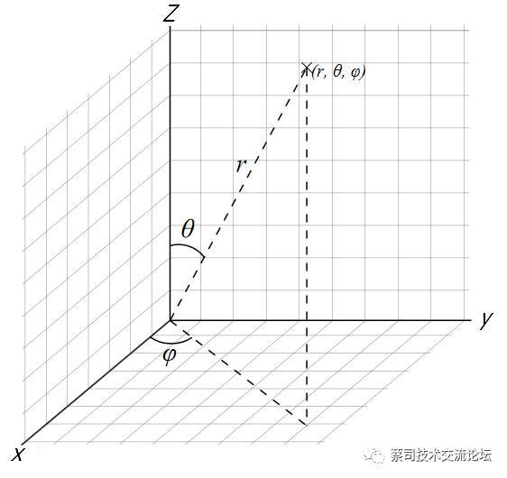

### get_ray函数
```python
def get_ray(x_final, y_final, z_final):
```
定义一个函数`get_ray`，它接受三个参数：x_final, y_final, z_final，这些参数代表一个3D空间中的点。

```python
    length = torch.sqrt(torch.pow(x_final, 2) + torch.pow(y_final, 2) + torch.pow(z_final, 2))
```
计算从原点到(x_final, y_final, z_final)的距离，即光线的长度。

```python
    ray_direction = torch.stack([torch.div(x_final, length), torch.div(y_final, length), torch.div(z_final, length)], dim=1)
```
计算光线的方向。这是通过将每个坐标除以其长度来得到的，这样我们就得到了一个单位向量，它指向(x_final, y_final, z_final)。

```python
    return ray_direction, length
```
返回光线的方向和长度。

### render函数
这个函数的目的是渲染一个3D模型，给定光线的方向和长度、模型的顶点和面，以及一个叫做i_final的参数（其具体含义从代码中不明确）。

```python
def render(ray_direction, length, vertex, face, i_final):
```
定义`render`函数，它接受五个参数。

```python
    max_dist = 70
```
设置一个名为`max_dist`的变量，其值为70。这可能是用于确定光线追踪时的最大距离。

以下三行代码将输入数据转移到CUDA设备上（如果有的话），这样可以使用GPU进行计算。
```python
    vertex = vertex.cuda()
    face = face.cuda()
    i_final = i_final.cuda()
```

```python
    mask = filtermask(ray_direction, vertex)
```
调用`filtermask`函数来获取一个掩码，该掩码指示哪些光线与3D模型相交。

#### filtermask函数
这个函数基于给定的3D模型顶点数据，为每个光线生成一个掩码，表示该光线是否与模型相交。

```python
def filtermask(xyz, vertex):
```
定义`filtermask`函数，它接受两个参数：`xyz`（光线的方向）和`vertex`（3D模型的顶点）。

以下几行代码将光线的方向从笛卡尔坐标转换为球面坐标。
```python
    ptsnew = torch.zeros(xyz.shape)
    ...
    ptsnew[:, 2] = torch.atan2(xyz[:, 1], xyz[:, 0])
```

以下几行代码将3D模型的顶点从笛卡尔坐标转换为球面坐标。
```python
    with torch.no_grad():
        vertexnew = torch.zeros(vertex.shape)
        ...
        vertexnew[:, 2] = torch.atan2(vertex[:, 1], vertex[:, 0])
```


$\left\{\begin{array}{l}x=r\sin\theta\cos\phi\\y=r\sin\theta\sin\phi\\z=r\cos\theta\end{array}\right.$

$\left\{\begin{array}{l}r=\sqrt{x^2+y^2+z^2}\\\theta=\arccos\frac{z}{\sqrt{x^2+y^2+z^2}}\\\phi=\arctan(y,x)\end{array}\right.$


```python
min_v = torch.min(vertexnew[:, 1]) - np.pi / 18 / 3
max_v = torch.max(vertexnew[:, 1]) + np.pi / 18 / 3
min_h = torch.min(vertexnew[:, 2]) - np.pi / 18 / 3
max_h = torch.max(vertexnew[:, 2]) + np.pi / 18 / 3
```
- `vertexnew[:, 1]` 和 `vertexnew[:, 2]` 分别表示3D模型顶点的球面坐标中的仰角（elevation angle）和方位角（azimuthal angle）。
- `min_v` 和 `max_v` 计算3D模型所有顶点的仰角的最小和最大值，并稍微扩展这些值。这里的扩展值是 `np.pi / 18 / 3`，这大约是10度的1/3，也就是约3.33度。
- 同样，`min_h` 和 `max_h` 计算方位角的最小和最大值，并进行相同的扩展。

接下来的代码是为了生成一个掩码，该掩码表示哪些光线的方向落在上述计算的边界框内：

```python
mask = torch.gt(ptsnew[:, 2], min_h)
```
这行代码检查哪些光线的方位角大于边界框的最小方位角。满足条件的光线在掩码中被标记为1，否则为0。

```python
mask = torch.lt(ptsnew[:, 2], max_h) * mask
```
这行代码进一步检查哪些光线的方位角小于边界框的最大方位角，并使用逐元素乘法来更新掩码。这意味着只有当光线的方位角同时满足大于`min_h`和小于`max_h`时，掩码中的相应位置才为1。

```python
mask = torch.gt(ptsnew[:, 1], min_v) * mask
```
这行代码检查哪些光线的仰角大于边界框的最小仰角，并更新掩码。

```python
mask = torch.lt(ptsnew[:, 1], max_v) * mask
```
这行代码检查哪些光线的仰角小于边界框的最大仰角，并更新掩码。

最终，`mask`中值为1的位置表示那些与3D模型边界框相交的光线，值为0的位置表示那些与边界框不相交的光线。

简而言之，这段代码的目的是为了**快速确定哪些光线可能与3D模型相交，而不需要进行完整的光线-模型相交测试。这是一个常用的优化技巧，称为边界框测试**。
返回掩码，它指示哪些光线与3D模型相交。

---

以下两行代码创建两个掩码：一个用于与3D模型相交的光线，另一个用于与3D模型不相交的光线。
```python
    mask_mesh = (mask == 1).flatten()
    mask_bg = (mask == 0).flatten()
```

以下几行代码使用上面的掩码来获取与3D模型相交的光线的方向、i_final值和长度。
```python
    mesh_ray_direction = ray_direction[mask_mesh]
    mesh_i = i_final[mask_mesh]
    mesh_ray_length = length[mask_mesh]
```

```python
    mesh_ray_distance, mesh_ray_intersection = render_sub(mesh_ray_direction, mesh_ray_length, vertex, face)
```
调用`render_sub`函数来获取与3D模型相交的光线的距离和交点。

---

### render_sub函数
这个函数是`render`和`render_div`函数的辅助函数，用于计算光线与3D模型的交点。

```python
def render_sub(ray_direction, length, vertex, face):
```
定义`render_sub`函数，它接受四个参数。

以下几行代码将输入数据转移到CUDA设备上。
```python
    ray_direction = ray_direction.cuda()
    length = length.cuda()
    vertex = vertex.cuda()
    face = face.cuda()
```

```python
    face = face.long()
```
将面数据转换为长整型。

```python
    epsilon = sys.float_info.epsilon
```
获取系统的浮点数精度，这通常用于避免除以零的错误。

```python
    max_dist = 70
```
设置一个名为`max_dist`的变量，其值为70。

以下几行代码进行一系列的数学计算，用于计算光线与3D模型的交点。这部分代码涉及到光线追踪的核心算法，特别是Möller–Trumbore intersection algorithm，用于快速检测光线与三角形的交点。

这段代码是光线追踪中的一个关键部分，用于确定光线与三角形网格的交点。这是通过Möller–Trumbore交点算法实现的，该算法是计算光线与三角形交点的高效方法。让我们逐行分析这段代码：

1. `lidar_origin = torch.zeros(3).cuda()`: 定义LiDAR的原点，这里假设LiDAR位于坐标原点。

2. `n_rays = ray_direction.shape[0]`: 获取光线的数量。

3. `meshes = torch.nn.functional.embedding(face, vertex)`: 使用`embedding`函数将面的索引转换为对应的顶点坐标，得到每个面的三个顶点。

4. `n_meshes = meshes.shape[0]`: 获取三角形网格的数量。

开始算法计算

这段代码实现了Möller–Trumbore交点算法，用于确定光线与三角形是否相交。为了更好地理解这个算法，我们可以将代码与算法的数学描述相结合。以下是详细的步骤：

1. **三角形的边的计算**
   - $E_1 = P_1 - P_0$
   - $E_2 = P_2 - P_0$
   
   这里，$P_0$, $P_1$, 和 $P_2$ 是三角形的三个顶点。这两个向量表示三角形的两条边。

   ```python
   edge_1 = meshes[:, 1] - meshes[:, 0]
   edge_2 = meshes[:, 2] - meshes[:, 0]
   ```

2. **计算从LiDAR原点到三角形的一个顶点的向量**
   - $S = o - P_0$
   
   其中，$o$ 是LiDAR的原点。

   ```python
   origin_tile = torch.unsqueeze(lidar_origin, 0).repeat([n_meshes, 1])
   T = origin_tile - meshes[:, 0]
   ```

3. **为每个三角形复制每个光线的方向**
   - $\vec{d}$
   
   这里，$\vec{d}$ 是光线的方向。

   ```python
   rays = torch.reshape(ray_direction, [-1, 1, 3]).repeat([1, n_meshes, 1])
   ```

4. **计算光线方向和三角形的一个边的外积**
   - $S_1 = \vec{d} \times E_2$

   ```python
   P = torch.cross(rays, edge_2)
   ```

5. **计算行列式，用于判断光线是否与三角形平行**
   - $E_1 \cdot S_1$

   如果行列式接近于0，那么光线与三角形平行，不会有交点。

   ```python
   det = torch.sum(torch.mul(edge_1, P), 2)
   ```

6. **获取行列式的符号**
   - $sign(E_1 \cdot S_1)$

   ```python
   det_sign = torch.sign(det)
   ```

7. **根据行列式的符号调整向量T**:
   - $S \sim S \cdot sign(E_1 \cdot S_1)$

   ```python
   T = torch.mul(T, det_sign_tile)
   ```


8. **计算u参数**
   <!-- - $u = \frac{S \cdot S_1}{E_1 \cdot S_1}$ -->
   - $u = S \cdot S_1$
   这里的u参数表示光线与三角形交点在三角形内的位置。

   ```python
   u = torch.sum(torch.mul(T, P), 2)
   ```

9. **计算$S_2$向量**
   - $S_2 = S \times E_1$
   
   Q向量是向量S和三角形的另一个边的外积$S_2$。

   ```python
   Q = torch.cross(T, edge_1)
   ```

10. **计算v参数**
    <!-- - $v = \frac{\vec{d} \cdot S_2}{E_1 \cdot S_1}$ -->
    - $v = \vec{d} \cdot S_2$

    v参数与u参数类似，也表示光线与三角形交点在三角形内的位置。

    ```python
    v = torch.sum(torch.mul(rays, Q), 2)
    ```

11. **计算t参数**
    - $t = \frac{E_2 \cdot S_2}{E_1 \cdot S_1}$
    
    t参数表示光线与三角形的交点距离LiDAR的距离。

    ```python
    t = torch.sum(torch.mul(edge_2, Q), 2)
    t /= (det + epsilon)
    ```

接下来的几行代码是一系列条件检查，确保交点在三角形内部，并且光线在正确的方向上。

12. **条件检查**
    - 如果 $E_1 \cdot S_1$ 接近于0（由`epsilon`定义），则光线与三角形平行 ($u+v\to \infty$)。（1）
    - 如果 $u < 0$ 或 $u > E_1 \cdot S_1$，则交点不在三角形内。 （2）
    - 如果 $v < 0$ 或 $u + v > E_1 \cdot S_1$，则交点不在三角形内。 （3）
    - 如果 $t < 0$，则光线与三角形在错误的方向上相交。（4）

    ```python
    t = torch.where(det < epsilon, torch.ones_like(t) * max_dist, t)
    t = torch.where(u < 0, torch.ones_like(t) * max_dist, t)
    t = torch.where(u > det, torch.ones_like(t) * max_dist, t)
    t = torch.where(v < 0, torch.ones_like(t) * max_dist, t)
    t = torch.where(u + v > det, torch.ones_like(t) * max_dist, t)
    t = torch.where(t < 0, torch.ones_like(t) * max_dist, t)
    ```
    Note:
    实际算法中，为了优化，此处减少了除运算，改为比较。

    理论算法中，

    $u = \frac{S \cdot S_1}{E_1 \cdot S_1}$

    $v = \frac{\vec{d} \cdot S_2}{E_1 \cdot S_1}$
    
    从行列式理解 $E_1 \cdot S_1$ 接近于0 空间坍塌，以及 $u+v<1$ 对应（1）

    $0 \le u,v \le 1$ 对应 （2）（3）

    $0 < t$ 对应（4）

13. **找到与每个光线相交的最近的三角形**
    - 对于每个光线，找到与其相交的所有三角形中最近的交点。

    ```python
    min_t, _ = torch.min(t, dim=1)
    ```

14. **计算光线与三角形的交点的坐标**
    - $P = o + t \times \vec{d}$

    ```python
    min_t_tile = torch.unsqueeze(min_t, 1).repeat([1, 3])
    origin_tile = torch.unsqueeze(lidar_origin, 0).repeat([n_rays, 1])
    ray_intersection = origin_tile + min_t_tile * ray_direction
    ```

15. **返回结果**
    - 返回每个光线的交点距离$t$和坐标$P$。

    ```python
    return ray_distance, ray_intersection
    ```

总的来说，这段代码使用Möller–Trumbore算法来计算每个光线与三角形的交点，并返回最近的交点的距离和坐标。


---

以下两行代码将结果转移到CUDA设备上。
```python
    mesh_ray_distance = mesh_ray_distance.cuda()
    mesh_ray_intersection = mesh_ray_intersection.cuda()
```

以下两行代码计算与3D模型不相交的光线长度$t$，以及方向向量$d$，生成背景激光雷达点坐标$P'=(d^T * t)^T$

shape: (3,N) * (N,) = (3,N) -> (N,3)

```python
    bg_ray_distance = length[mask_bg]
    bg_ray_intersection = (ray_direction[mask_bg].t() * length[mask_bg]).t()
```

```python
    bg_i = i_final[mask_bg]
```
获取与3D模型不相交的光线的i_final值。

```python
    ray_intersection = torch.cat([mesh_ray_intersection, bg_ray_intersection], dim=0)
```
将与3D模型相交和不相交的光线的交点合并成一个张量。

以下几行代码创建一个条件，该条件检查与3D模型相交的光线的距离是否等于其长度。如果是，则使用mesh_i的值，否则使用144./255。
```python
    condition = torch.eq(mesh_ray_distance, mesh_ray_length)
    i = torch.where(condition, mesh_i, torch.ones_like(mesh_i) * 144. / 255.)
```

对于存在与Mesh相交的光线点，通过比较光线长度。令这些点的反射强度为`144. / 255.`，

```python
    ii = torch.cat([i, bg_i], dim=0)
```
将与3D模型相交和不相交的光线的i值合并成一个张量，形成新的反射强度向量。

```python
    point_cloud = torch.cat([ray_intersection, ii.reshape(-1, 1)], dim=1)
```
创建一个点云，其中每个点都有一个3D位置和一个i值。

```python
    return point_cloud
```
返回点云。

由于代码较长，我已经为你解释了`get_ray`和`render`函数。如果你希望我继续解释其他函数，请告诉我。


好的，我们继续分析接下来的函数。

### render_div函数
这个函数与`render`函数类似，但它返回更多的信息，并对所有光线进行处理，而不仅仅是与3D模型相交的光线。

```python
def render_div(ray_direction, length, vertex, face, i_final):
```
定义`render_div`函数，它接受五个参数。

```python
    max_dist = 70
```
设置一个名为`max_dist`的变量，其值为70。

以下三行代码将输入数据转移到CUDA设备上。
```python
    vertex = vertex.cuda()
    face = face.cuda()
    i_final = i_final.cuda()
```

```python
    mask = filtermask(ray_direction, vertex)
```
调用`filtermask`函数来获取一个掩码，该掩码指示哪些光线与3D模型相交。

以下两行代码创建两个掩码：一个用于与3D模型相交的光线，另一个用于与3D模型不相交的光线。
```python
    mask_mesh = (mask == 1).flatten()
    mask_bg = (mask == 0).flatten()
```

以下几行代码使用上面的掩码来获取与3D模型相交的光线的方向、i_final值和长度。
```python
    mesh_ray_direction = ray_direction[mask_mesh]
    mesh_i = i_final[mask_mesh]
    mesh_ray_length = length[mask_mesh]
```

```python
    mesh_ray_distance, mesh_ray_intersection = render_sub(mesh_ray_direction, mesh_ray_length, vertex, face)
```
调用`render_sub`函数来获取与3D模型相交的光线的距离和交点。

以下两行代码将结果转移到CUDA设备上。
```python
    mesh_ray_distance = mesh_ray_distance.cuda()
    mesh_ray_intersection = mesh_ray_intersection.cuda()
```

以下两行代码计算与3D模型不相交的光线的距离和交点。
```python
    bg_ray_distance = length[mask_bg]
    bg_ray_intersection = (ray_direction[mask_bg].t() * length[mask_bg]).t()
```

```python
    bg_i = i_final[mask_bg]
```
获取与3D模型不相交的光线的i_final值。

```python
    whole_ray_intersection = (ray_direction.t() * length).t()
```
计算所有光线的交点。

```python
    whole_i = i_final
```
获取所有光线的i_final值。

```python
    ray_intersection = torch.cat([mesh_ray_intersection, bg_ray_intersection], dim=0)
```
将与3D模型相交和不相交的光线的交点合并成一个张量。

以下几行代码创建一个条件，该条件检查与3D模型相交的光线的距离是否等于其长度。如果是，则使用mesh_i的值，否则使用144./255。
```python
    condition = torch.eq(mesh_ray_distance, mesh_ray_length)
    i = torch.where(condition, mesh_i, torch.ones_like(mesh_i) * 144. / 255.)
```

```python
    ii = torch.cat([i, bg_i], dim=0)
```
将与3D模型相交和不相交的光线的i值合并成一个张量。

```python
    point_cloud_mesh = torch.cat([mesh_ray_intersection, i.reshape(-1, 1)], dim=1)
```
创建一个与3D模型相交的光线的点云。

```python
    point_cloud = torch.cat([whole_ray_intersection, whole_i.reshape(-1, 1)], dim=1)
```
创建一个所有光线的点云。

```python
    point_cloud[mask_mesh] = point_cloud_mesh
```
更新点云，使其包含与3D模型相交的光线的信息。

```python
    return point_cloud.data.cpu(), mask_bg.data.cpu(), mask_mesh.data.cpu(), len(ray_intersection)
```
返回点云和其他相关信息。


> render()点云合成时为集中处理。
> render_div()点云合成时 mesh相交 与 不相交的数据分开处理，再根据Mask叠加。


### loadmesh函数
这个函数用于从指定路径加载一个PLY文件，并返回其顶点和面的数据。

```python
def loadmesh(path, x_of=9, y_of=0, r=0.5):
```
定义`loadmesh`函数，它接受一个必需的参数`path`（PLY文件的路径）和三个可选参数`x_of`、`y_of`和`r`，这些参数用于后续的顶点变换。

```python
    r = 0.3
```
重新为`r`赋值，这意味着上面函数的默认参数`r=0.5`实际上被覆盖了。

```python
    plydata = PlyData.read(path)
```
使用`PlyData`的`read`方法从指定路径读取PLY文件。

```python
    z_of = -1.73 + r / 2.
```
计算一个变量`z_of`，它将用于后续的顶点变换。

```python
    from scipy.spatial.transform import Rotation as R
```
从`scipy`库中导入`Rotation`类，用于处理3D旋转。

以下几行代码从PLY文件中提取顶点数据，并乘以`r`来进行缩放。
```python
    x = torch.FloatTensor(plydata['vertex']['x']).cuda() * r
    y = torch.FloatTensor(plydata['vertex']['y']).cuda() * r
    z = torch.FloatTensor(plydata['vertex']['z']).cuda() * r
```

```python
    vertex = torch.stack([x, y, z], dim=1)
```
将x、y和z坐标堆叠起来，形成一个顶点张量。

以下几行代码创建一个旋转矩阵，然后将其应用于顶点数据。
```python
    r = R.from_euler('zxy', [0, 90, 0], degrees=True)
    rotation = torch.tensor(r.as_matrix(), dtype=torch.float)
    rotation = rotation.cuda()
    vertex = vertex.cuda()
    vertex = vertex.permute(1, 0) #转置
    vertex = torch.matmul(rotation, vertex)
    vertex = vertex.permute(1, 0)
```

以下三行代码将顶点数据进行平移。
```python
    vertex[:,0] = vertex[:,0] + x_of
    vertex[:, 1] = vertex[:, 1] + y_of
    vertex[:, 2] = vertex[:, 2] + z_of
```

以下两行代码从PLY文件中提取面数据，并将其转换为CUDA张量。
```python
    face = plydata['face'].data['vertex_indices']
    face = torch.Tensor(np.vstack(face)).cuda().long()
```

```python
    return vertex, face
```
返回处理后的顶点和面数据。

Note:

>load_mesh 中对 mesh 顶点进行了放缩与旋转操作，为什么对于面的数据直接读取而没有进行相应处理？

在3D图形和计算机图形学中，当对一个物体的顶点进行变换（如平移、旋转或缩放）时，其面的定义（通常由顶点索引组成）不需要改变。这是因为面是由其组成的顶点定义的，而不是由其自身的坐标定义的。

让我们详细解释一下：

1. **顶点的变换**:
   - 当您对一个物体的顶点进行变换时，您实际上是在改变这些顶点的位置。例如，如果您将一个顶点从`(x, y, z)`移动到`(x+1, y, z)`，那么这个顶点的位置就发生了变化。

2. **面的定义**:
   - 一个面通常由三个或更多的顶点定义（在三角形的情况下是三个）。这些顶点是通过索引来引用的，而不是通过它们的实际坐标。例如，一个面可能由顶点2、3和4定义，而不是由`(x1, y1, z1)`、`(x2, y2, z2)`和`(x3, y3, z3)`定义。

3. **当顶点变换时发生了什么**:
   - 当您对顶点进行变换时，这些顶点的坐标会改变，但它们的索引不会。因此，即使顶点2的位置从`(x, y, z)`移动到`(x+1, y, z)`，它仍然被称为顶点2。

4. **面的变换**:
   - 当您对一个物体的顶点进行变换时，这些变换自动应用于由这些顶点定义的所有面。因为面是由顶点的索引定义的，所以不需要对面本身进行任何变换。只要顶点的位置发生了变化，由这些顶点定义的面的形状和位置也会相应地变化。

因此，在`load_mesh`函数中，对顶点进行了放缩和旋转操作，但没有对面进行相应的处理，这是完全合理的。当顶点的位置改变时，由这些顶点定义的面自动适应这些变化。
### savemesh函数
这个函数用于将修改后的3D模型数据保存回PLY文件。

```python
def savemesh(path_r, path_w, vet, face, x_of=5, y_of=0, r=0.5):
```
定义`savemesh`函数，它接受五个必需的参数和三个可选参数。

```python
    plydata = PlyData.read(path_r)
```
从指定路径`path_r`读取PLY文件。

```python
    z_of = -1.73 + r / 2.
```
计算一个变量`z_of`，它将用于后续的顶点变换。

以下三行代码更新PLY文件的顶点数据。
```python
    plydata['vertex']['x'] = (vet[:, 0] - x_of) / r
    plydata['vertex']['y'] = (vet[:, 1] - y_of) / r
    plydata['vertex']['z'] = (vet[:, 2] - z_of) / r
```

```python
    plydata.write(path_w)
```
将修改后的PLY数据写入到`path_w`指定的路径。

```python
    return
```
函数结束，没有返回任何值。

### local_translate函数
这个函数对3D模型的所有顶点进行平移。

```python
def local_translate(vertices, vector):
```
定义`local_translate`函数，它接受两个参数：`vertices`（3D模型的顶点）和`vector`（平移向量）。

```python
    return vertices + torch.reshape(vector, (1, 3))
```
将`vector`重塑为形状为(1, 3)的张量，并将其加到每个顶点上，然后返回平移后的顶点。


